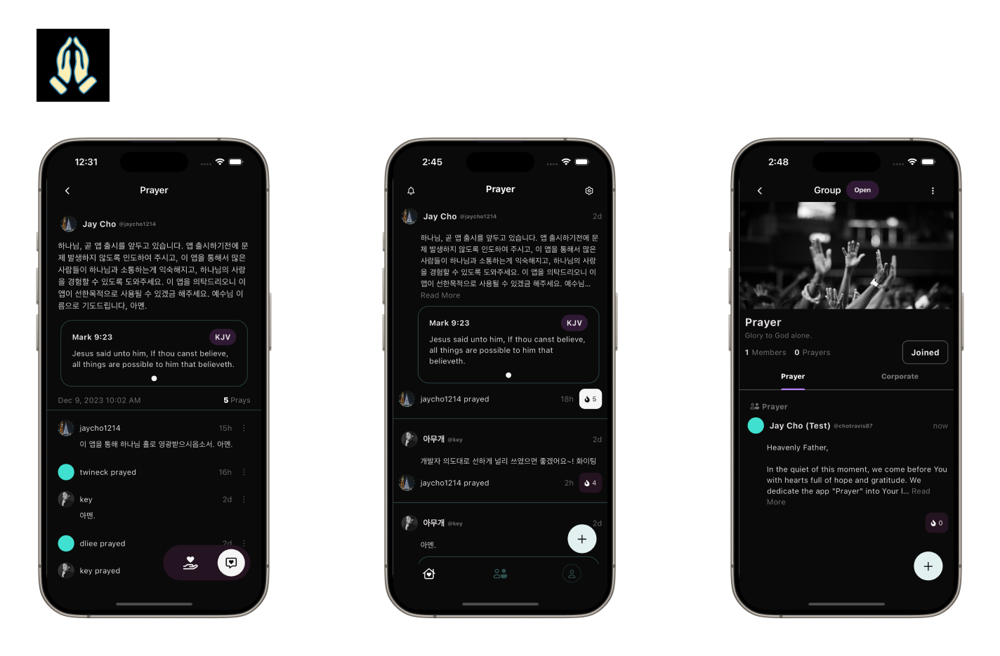

<a href="http://www.crosswand.com/app/prayer"></a>

## Prayer

<p align="center">
  <a href="https://play.google.com/store/apps/details?id=com.crosswand.prayer">
    
  </a>
  <a href="https://apps.apple.com/app/id6471775802
">
    
  </a>
</p>

- **State:** Production
- **People:** [Jay Cho](https://github.com/jaycho1214)

## Intro

> A new command I give you: Love one another. As I have loved you, so you must love one another.
>
> - John 13:34 (NIV)

**Introducing "Prayer"**, An open-source app that embodies the Christian value of loving one another through the power of collective prayer.

- **Share Your Prayer:** Users can share their personal prayer requests, inviting others to join in support and prayer, creating a nurturing community bound by faith and love.
  
- **Pray for Others:** Be part of a global network of believers, offering your prayers to support others. Experience how collective praying uplifts and strengthens the entire community.

- **Witness Miracles:** Discover the strength and miracles that come from prayers amplified by unity and love.

Join "Prayer" today and be part of a movement that emphasizes the most important Christian value—loving each other—through the communal and compassionate act of praying together.

## Getting Started

### Prerequisites

- [Flutter](https://flutter.dev/)

### Download Prayer
```sh
git clone https://github.com/theagapefoundation/prayer.git
cd prayer
```

### Run Prayer
```sh
flutter pub get
flutter run
```

## Thanks

Thanks to all [our contributors](/docs/contributors.md).

## License

MIT License. See [LICENSE](LICENSE).
